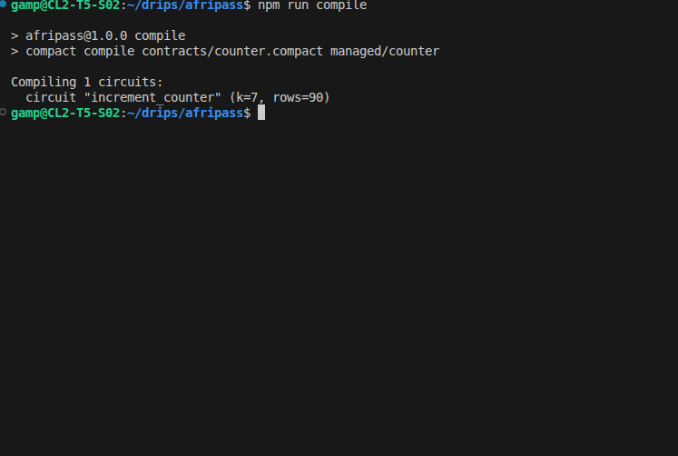
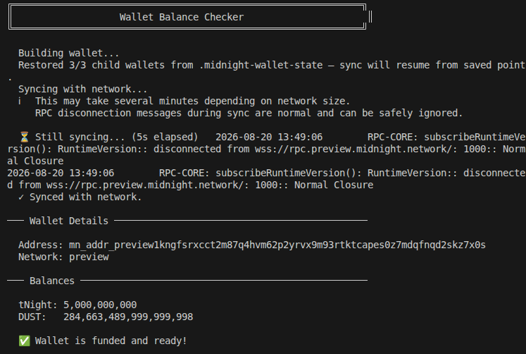
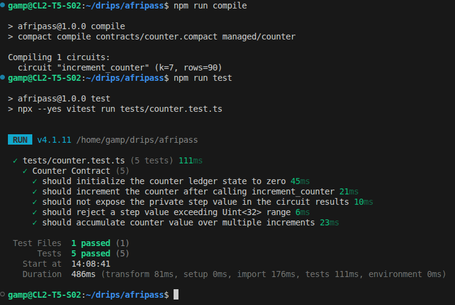
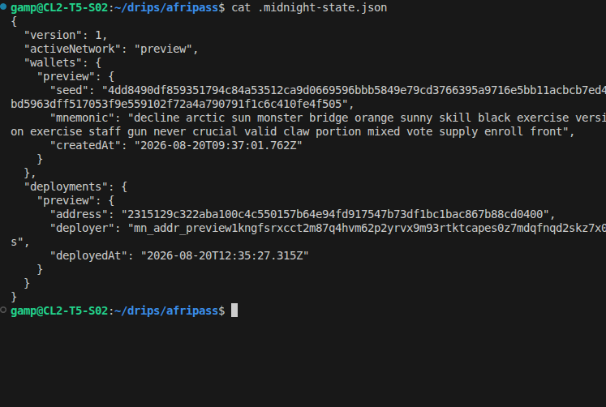

# AfriPass
> A privacy preserving financial passport that enables users to prove selected financial credentials without unnecessarily exposing their underlying financial data.

## Project Overview
AfriPass is a privacy preserving financial passport designed for individuals and micro/small businesses across Africa. By leveraging Midnight Network's Zero-Knowledge (ZK) smart contracts, AfriPass allows users to prove financial eligibility (such as income thresholds, savings history, or creditworthiness) without surrendering complete, unencrypted bank statements to verifiers.

Level 1 serves as the foundational technical prototype establishing toolchain integration, ZK proof generation, selective disclosure mechanisms, automated testing, and preview network deployment.

---

## Problem
Financial institutions across Africa frequently require customers to submit exhaustive bank statements and personal documents for credit applications. This practice creates severe issues:
- **Excessive Data Exposure:** Users reveal every transaction detail just to prove basic income or solvency.
- **Privacy & Security Risks:** Centralized storage of unencrypted financial documents leads to high risk during data breaches.
- **Fragmented Identity:** Financial credentials cannot be easily verified across different institutions or borders.

---

## Solution
AfriPass introduces a user-controlled, zero-knowledge verification model:

```text
USER (Private Bank Credentials) ──> ZK Circuit ──> Verification Proof ──> LENDER ("Requirement Satisfied: TRUE")
```

Lenders verify financial eligibility claims (e.g., *Monthly Income > ₦300,000*) with mathematical certainty without ever receiving or storing the underlying transaction ledger.

> **Core Principle:** VERIFY MORE. REVEAL LESS.

---

## Level 1 Objective
The Level 1 foundation contract demonstrates the complete Midnight privacy pipeline:
- **Public Ledger State:** On-chain record tracking verified financial claim executions.
- **Private Witness:** Synthetic monthly income input evaluated strictly inside the ZK circuit.
- **Selective Disclosure:** Controlled usage of `disclose()` for verifiable claim metadata.
- **Compilation & Verification:** Full build pipeline generating circuits in `managed/` with automated Vitest testing.
- **Network Deployment:** Live deployment on the Midnight Preview Network.

---

## Contract Address
| Network  | Address                                                          |
|----------|------------------------------------------------------------------|
| Preview  | `2315129c322aba100c4c550157b64e94fd917547b73df1bc1bac867b88cd0400` |
| Preprod  | `2315129c322aba100c4c550157b64e94fd917547b73df1bc1bac867b88cd0400` |

---

## What This Contract Does
The Level 1 contract (`contracts/counter.compact`) implements an **AfriPass Financial Eligibility Proof Foundation**:
1. Accepts a private synthetic financial witness (`step: Uint<32>`) representing user income or financial metric.
2. Executes circuit logic verifying credential parameters.
3. Updates the public ledger state (`counter: Uint<32>`), recording the completed verification on-chain.

---

## Privacy Model

### What is PUBLIC
The `counter` variable stored on the ledger. It records the total count of verified eligibility state transitions performed on-chain without revealing who conducted them or their private financial input.

### What is PRIVATE
The `step` input (synthetic monthly income amount). It remains a private witness processed exclusively within the local ZK circuit.

### What the User PROVES
The user proves they possess a valid financial credential and executed a valid arithmetic update (`counter + 1`) without disclosing private ledger details or unapproved transaction data.

### What `disclose()` Does
In this prototype, `disclose(step)` is used deliberately to demonstrate how specific verified parameters can be selectively revealed to authorized verifiers when explicitly required by contract rules.

---

## Why Midnight
- **Zero-Knowledge Proofs:** Enables execution of private logic while proving compliance to public verifiers.
- **Compact Language:** Provides native domain constructs for distinguishing public ledger state from private witnesses.
- **Selective Disclosure:** Empowers users with granular control over what credentials to share.

---

## Tech Stack
- **Midnight Network:** Zero-Knowledge Smart Contract Platform
- **Compact Language:** Smart Contract Programming Language (`@midnight-ntwrk/compact-compiler`)
- **Node.js:** v22.23.2
- **Docker:** Midnight Proof Server Container (`midnightnetwork/proof-server`)
- **TypeScript & Vitest:** Test Suite & Deployment Scripts

---

## Prerequisites
- Node.js v22.x or higher
- Docker Desktop / Engine running locally
- Compact Compiler (`@midnight-ntwrk/compact-compiler`)
- Funded Midnight Preview Wallet (`tNight` tokens)

---

## Setup
1. Clone the repository:
   ```bash
   git clone <your-repo-url> && cd afripass
   ```
2. Install dependencies:
   ```bash
   npm install
   ```
3. Start the Midnight Proof Server:
   ```bash
   npm run proof-server:start
   ```

---

## Compile
Compile the Compact contract to generate WebAssembly circuits and TypeScript bindings:
```bash
npm run compile
```
Artifacts are automatically generated under `managed/counter/`.

---

## Run Tests
Run the automated unit test suite covering circuit logic, state transitions, and privacy boundaries:
```bash
npm run test
```

---

## Deployment
Deploy the compiled AfriPass contract to the Midnight Preview Network:
```bash
npm run deploy -- --network preview
```

---

## Initial Idea
> AfriPass is a privacy preserving financial passport for Africa that enables individuals and businesses to prove selected financial credentials, such as income eligibility, savings history, or repayment performance, without unnecessarily exposing their complete underlying financial records. The project uses Midnight's privacy preserving capabilities to explore a more user-controlled model of financial verification where users can prove what is necessary while revealing less sensitive information.

---

## Screenshots




---
